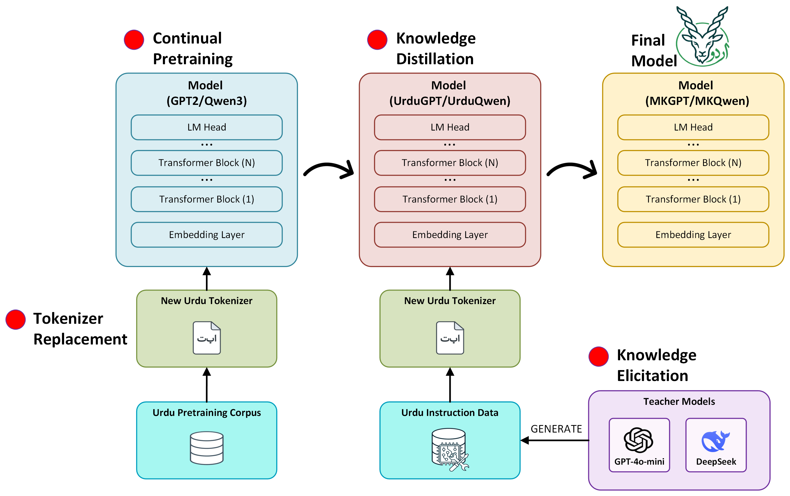

# Markhor

Official implementation of **Markhor: A Framework for Adapting LLMs to Urdu via Alignment-Free Tokenizer Replacement**, accepted to the **Findings of AACL-IJCNLP 2026**.

Markhor investigates whether pretrained decoder-only language models can be effectively adapted to Urdu through complete tokenizer replacement without relying on cross-lingual vocabulary alignment. The framework consists of tokenizer replacement, continual pretraining, knowledge elicitation, and instruction tuning.

## Framework

<p align="center">
  
</p>

## Repository Structure

```text
Markhor/
├── assets/
│   └── markhor_framework.png
├── continual_pretraining/
│   ├── continual_pretraining_gpt2.py
│   ├── continual_pretraining_qwen.py
│   └── text_dataset.py
├── evaluation/
│   ├── classification/
│   │   ├── evaluation_gpt2.py
│   │   └── evaluation_qwen3.py
│   └── qa/
│       ├── generate_gpt2.py
│       └── generate_qwen.py
├── instruction_tuning/
│   ├── instruction_tuning_gpt2.py
│   └── instruction_tuning_qwen.py
├── tokenization/
│   └── train_tokenizer_gpt2.py
├── LICENSE
├── README.md
└── requirements.txt
```

## Installation

Clone the repository:

```bash
git clone https://github.com/zainali93/Markhor.git
cd Markhor
```

Install the required Python packages:

```bash
pip install -r requirements.txt
```

## Data

The datasets used for pretraining, instruction tuning, and evaluation are hosted separately on Hugging Face:

**[Markhor-Data](https://huggingface.co/datasets/ma1993/Markhor-Data)**

Install/authenticate the Hugging Face CLI if required, and download the complete dataset from the root of this repository:

```bash
hf download ma1993/Markhor-Data \
    --repo-type dataset \
    --local-dir data
```

This automatically creates the directory structure expected by the training and evaluation scripts:

```text
data/
├── evaluation/
│   ├── classification/
│   │   ├── emotion.xlsx
│   │   ├── fnd1.xlsx
│   │   ├── fnd2.xlsx
│   │   ├── fnd3.xlsx
│   │   └── hate_speech.xlsx
│   └── qa/
│       ├── indomain/
│       │   ├── test_biology.json
│       │   ├── test_chemistry.json
│       │   ├── test_geography.json
│       │   ├── test_history.json
│       │   └── test_physics.json
│       └── outofdomain/
│           ├── biology_qa_urdu.json
│           ├── chemistry_qa_urdu.json
│           ├── geography_qa_urdu.json
│           ├── history_qa_urdu.json
│           └── physics_qa_urdu.json
├── instruction_tuning/
│   ├── all_urdu_instructions_deepsk_gpt4o.json
│   ├── urdu_instructions_gpt4o.json
│   └── urdu_instructions.json
└── pretraining/
    └── urdu_train_text_new.txt
```

## Tokenizer Training

For the GPT-2-based model, train the Urdu tokenizer using:

```bash
python tokenization/train_tokenizer_gpt2.py
```

The trained tokenizer is saved under:

```text
tokenizers/urdu_tokenizer50k.json
```

For the Qwen3-based model, tokenizer training is performed as part of the continual pretraining script.

## Continual Pretraining

### GPT-2

```bash
python continual_pretraining/continual_pretraining_gpt2.py
```

The pretrained Urdu model is saved to:

```text
models/gpt2_urdu/
```

### Qwen3

```bash
python continual_pretraining/continual_pretraining_qwen.py
```

The pretrained Urdu model is saved to:

```text
models/qwen_urdu/
```

## Instruction Tuning

### MKGPT

MKGPT is instruction-tuned in two stages. In:

```text
instruction_tuning/instruction_tuning_gpt2.py
```

set:

```python
STAGE = 1
```

and run:

```bash
python instruction_tuning/instruction_tuning_gpt2.py
```

After Stage 1 has completed, change the configuration to:

```python
STAGE = 2
```

and run the script again.

The final model is saved to:

```text
models/mkgpt/
```

### MKQwen

MKQwen is instruction-tuned using the combined instruction dataset:

```bash
python instruction_tuning/instruction_tuning_qwen.py
```

The final model is saved to:

```text
models/mkqwen/
```

## Evaluation

### Classification

Classification evaluation scripts are provided for MKGPT and MKQwen:

```text
evaluation/classification/evaluation_gpt2.py
evaluation/classification/evaluation_qwen3.py
```

Select the required dataset by changing `DATASET_NAME` in the corresponding script. Available datasets are:

```text
fnd1
fnd2
fnd3
hate_speech
emotion
```

Then run, for example:

```bash
python evaluation/classification/evaluation_gpt2.py
```

or:

```bash
python evaluation/classification/evaluation_qwen3.py
```

The classification scripts provide default hyperparameters. These may be tuned for individual datasets as required.

### Question Answering

QA generation is provided for both MKGPT and MKQwen:

```text
evaluation/qa/generate_gpt2.py
evaluation/qa/generate_qwen.py
```

Select the evaluation setting and domain in the script:

```python
QA_SET = "indomain"
DOMAIN = "biology"
```

`QA_SET` can be:

```text
indomain
outofdomain
```

and the available domains are:

```text
biology
chemistry
geography
history
physics
```

Run:

```bash
python evaluation/qa/generate_gpt2.py
```

or:

```bash
python evaluation/qa/generate_qwen.py
```

Generated responses are saved under:

```text
evaluation/qa/results/
```

## Models

The framework produces two Urdu-adapted models:

- **MKGPT** — based on GPT-2
- **MKQwen** — based on Qwen3-0.6B

Model release links will be added here.

## Citation

If you use Markhor in your research, please cite:

```bibtex
@inproceedings{ali2026markhor,
  title     = {Markhor: A Framework for Adapting LLMs to Urdu via Alignment-Free Tokenizer Replacement},
  author    = {Ali, Muhammad Zain and Wang, Yuxia and Manzoor, Muhammad Arslan and Smith, Tony and Pfahringer, Bernhard},
  booktitle = {Findings of the Association for Computational Linguistics: AACL-IJCNLP 2026},
  year      = {2026}
}
```

The final proceedings citation will be updated after publication.

## License

The source code in this repository is released under the [MIT License](LICENSE).

The datasets are distributed separately through the Markhor-Data repository and may be subject to their respective source licenses and usage conditions.
